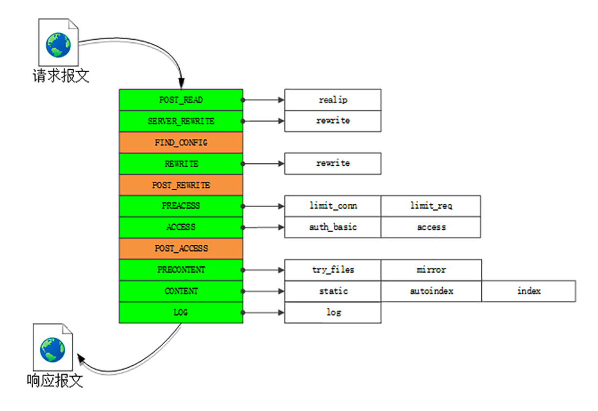

Nginx 则完全不同，“一反惯例”地没有使用多线程，而是使用了“进程池 + 单线程”的工作模式。

进程池：ginx 在启动的时候会预先创建好固定数量的 worker 进程，在之后的运行过程中不会再 fork 出新进程，这就是进程池。

而且可以自动把进程“绑定”到独立的 CPU 上，这样就完全消除了进程创建和切换的成本，能够充分利用多核 CPU 的计算能力。

在进程池之上，还有一个“master”进程，专门用来管理进程池。它的作用有点像是 supervisor（一个用 Python 编写的进程管理工具），用来监控进程，自动恢复发生异常的 worker，保持进程池的稳定和服务能力。

I/O 多路复用

I/O 多路复用接口： epoll。
把多个 HTTP 请求处理打散成碎片，都“复用”到一个单线程里，不按照先来后到的顺序处理，而是只当连接上真正可读、可写的时候才处理，如果可能发生阻塞就立刻切换出去，处理其他的请求。

通过这种方式，Nginx 就完全消除了 I/O 阻塞，把 CPU 利用得“满满当当”，又因为网络收发并不会消耗太多 CPU 计算能力，也不需要切换进程、线程，所以整体的 CPU 负载是相当低的。

Nginx“I/O 多路复用”的示意图，

epoll 还有一个特点，大量的连接管理工作都是在操作系统内核里做的，这就减轻了应用程序的负担，所以 Nginx 可以为每个连接只分配很小的内存维护状态。

Nginx 的 HTTP 处理有四大类模块：

    handler 模块：直接处理 HTTP 请求；
    filter 模块：不直接处理请求，而是加工过滤响应报文；
    upstream 模块：实现反向代理功能，转发请求到其他服务器；
    balance 模块：实现反向代理时的负载均衡算法。

handler ,职责链模式：
好像是工厂里的流水线，原料从一头流入，线上有许多工人会进行各种加工处理，最后从另一头出来的就是完整的产品。

    charset 模块实现了字符集编码转换；
    chunked 模块实现了响应数据的分块传输；
    range 模块实现了范围请求，只返回数据的一部分；
    rewrite 模块实现了重定向和跳转，还可以使用内置变量自定义跳转的 URI；
    not_modified 模块检查头字段“if-Modified-Since”和“If-None-Match”，处理条件请求；
    realip 模块处理“X-Real-IP”“X-Forwarded-For”等字段，获取客户端的真实 IP 地址；
    ssl 模块实现了 SSL/TLS 协议支持，读取磁盘上的证书和私钥，实现 TLS 握手和 SNI、ALPN 等扩展功能；
    http_v2 模块实现了完整的 HTTP/2 协议。

